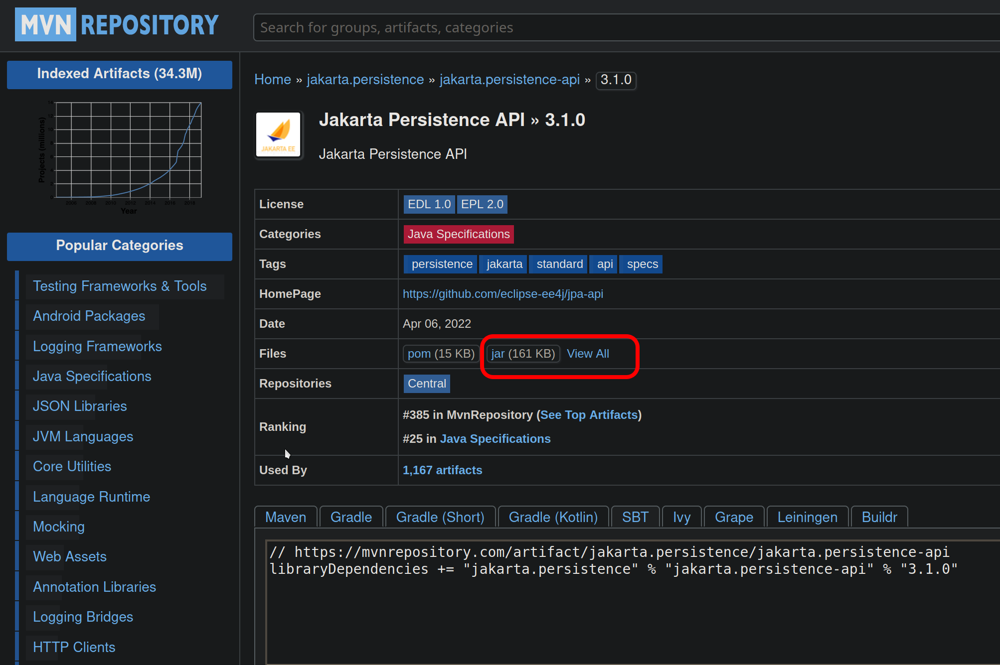

Intro
===========================================================
Nowadays (2020's) any important application, utilty, tool or framework seems to be built with the help of [Apache Maven](https://maven.apache.org/run.html) or new developments with [Gradle](https://gradle.org/). But, do not you can build the software on your own? How hard it is? Today I was reading the _Hibernate_ getting started [guide](https://docs.jboss.org/hibernate/orm/6.2/quickstart/html_single/), and I found that they did not use the framework from scratch, instead they provide a working example bundled with Maven and JUnit.

For me, always has been important to write/compile the code from scratch in order to gain a good understanding on what the software does. In this situation I will try to compile the examples entirely by hand without using Maven. Let's see how hard it is.

Adding first layer dependencies
===========================================================
The java code to be run is the _getting started_ examples provided in the bundled distribution of maven. The _getting started_ document points you to a zip containing the tutorials. This tutorials are being packaged with _Maven_ and has _JUnit_ (unit test framework), _slf4j_ (logging framework), _H2_ (in memory database) and _Hibernate_ as dependencies. 

The first thing is to download the dependencies defined in `pom.xml`. I will download those software from [Maven Central](https://mvnrepository.com/repos/central) but you can download it from anywhere else.
These are the required versions defined there:
* org.hibernate hibernate-core:6.0.0.CR2
* org.slf4j slf4j-simple:1.7.5
* junit junit:4.13.2
* com.h2database h2:1.4.197

Before to run the clases, some modifications where made:
  - The two clases on `Basic` folder, where place in the default package.
  - A `main()` method was added to the test class.
    ```java
    public static void main(String[] args) {
      NativeApiIllustrationTest app = new NativeApiIllustrationTest();
      app.setUp();
      app.testBasicUsage();
      app.tearDown();
    }
    ```
  - Any reference to _JUnit_ was removed, now the test class does not extends from `junit.framework.TestCase`.
  - The `@Overrides were removed`.

Then issue the following command to your terminal emulator. Please note that we also add the _classpath_ the _current working directory_ `.`:
```sh
javac -cp .:hibernate-core-6.0.0.CR2.jar:h2-1.4.197.jar NativeApiIllustrationTest.java
```

This will return several error messages, the first one is listed below:
```log
NativeApiIllustrationTest.java:73: error: cannot access EntityManagerFactory
                        sessionFactory.close();
                                      ^
  class file for jakarta.persistence.EntityManagerFactory not found
```

From that message it is easy to guess that `jakarta.persistence.EntityManagerFactory` class is not defined. Looking for that package on the web on [maven central](https://mvnrepository.com/search?q=jakarta+persistence) I found that `hibernate-core:6.0.0.CR2` [package](view-source:https://repo1.maven.org/maven2/org/hibernate/orm/hibernate-core/6.2.0.CR2/hibernate-core-6.2.0.CR2.pom) has the `jakarta.persistence-api` as dependency:
```xml
<dependency>
  <groupId>jakarta.persistence</groupId>
  <artifactId>jakarta.persistence-api</artifactId>
  <version>3.1.0</version>
  <scope>compile</scope>
  <exclusions>
    <exclusion>
      <artifactId>xml-apis</artifactId>
      <groupId>xml-apis</groupId>
    </exclusion>
  </exclusions>
</dependency>
```
I download the dependency as we did previously from here:
 

After that I updated the classpath, this is the command
```sh
javac -d target -cp .:../lib/hibernate-core-6.0.0.CR2.jar:h2-1.4.197.jar:../lib/jakarta.persistence-api-3.1.0.jar samplespkg/NativeApiIllustrationTest.java 
```
There you will the following notes:
```log
Note: NativeApiIllustrationTest.java uses or overrides a deprecated API.
Note: Recompile with -Xlint:deprecation for details.
Note: NativeApiIllustrationTest.java uses unchecked or unsafe operations.
Note: Recompile with -Xlint:unchecked for details.
```

Adding second tier dependencies
===========================================================
When you try to run the example with `java NativeApiIllustrationTest`, appears an error:
```log
Error: Unable to initialize main class NativeApiIllustrationTest
Caused by: java.lang.NoClassDefFoundError: org/hibernate/service/ServiceRegistry
```
I searched for this class and it belongs to `hibernate-core` package. As you can see here the process begins to be cumbersome. The next thing I will to try to do is to run the maven project and read the documentation about the compiler plugin. As the [documentation](https://maven.apache.org/plugins/index.html) states, Maven is a _plugin execution framework_ so it is a good idea to review how the compile plugin works. I believe that this could ease the further understanding of _Gradle_ packaging.

How Maven `compile` works
===========================================================
Before to understand this, you need to know that Maven process software sets by means of [lifecycles](https://maven.apache.org/guides/introduction/introduction-to-the-lifecycle.html). Basically, a lifecycle is composed of all the steps you repetively do when you want to release a software application e.g. clean (filter .gitignore), generate code (DTO classes generation), run tests, produce code insights, compile and finally package.

The base project provided with _Hibernate_ has the following folder structure, please note that the only available code is located in the `test` folder. This was one of the main reasons of this research, because I think that if you want to run a piece of code, it is better if it runs without bloatware, in this case the _Junit_ Java testing framework.

```sh
├── basic
│   ├── pom.xml
│   ├── src
│   │   └── test
│   │       ├── java
│   │       │   └── org
│   │       │       └── hibernate
│   │       │           └── tutorial
│   │       │               └── hbm
│   │       │                   ├── Event.hbm.xml
│   │       │                   ├── Event.java
│   │       │                   └── NativeApiIllustrationTest.java
│   │       └── resources
│   │           └── hibernate.cfg.xml
```

Maven performs two separation compilations, one for main application source at `src/main` and other for testing sources at `src/test`. The former is executed at the `compiler:compile` _goal_ and the later at `compiler:testCompile` _goal_ both from the _compile_ build phase. 

After compiling the test source with debugging options with `mvn test-compile -X` you find that command that is being used to compile the test is the following

```
-d /opt/hibernate-release-6.0.0.CR2/hibernate-tutorials.zip-6.0.0.CR2/basic/target/test-classes -classpath /opt/hibernate-release-6.0.0.CR2/hibernate-tutorials.zip-6.0.0.CR2/basic/target/test-classes:/opt/hibernate-release-6.0.0.CR2/hibernate-tutorials.zip-6.0.0.CR2/basic/target/classes:/home/jcammmmm/.m2/repository/org/hibernate/orm/hibernate-core/6.0.0.CR2/hibernate-core-6.0.0.CR2.jar:/home/jcammmmm/.m2/repository/jakarta/persistence/jakarta.persistence-api/3.0.0/jakarta.persistence-api-3.0.0.jar:/home/jcammmmm/.m2/repository/jakarta/transaction/jakarta.transaction-api/2.0.0/jakarta.transaction-api-2.0.0.jar:/home/jcammmmm/.m2/repository/org/jboss/logging/jboss-logging/3.4.3.Final/jboss-logging-3.4.3.Final.jar:/home/jcammmmm/.m2/repository/org/jboss/jandex/2.4.2.Final/jandex-2.4.2.Final.jar:/home/jcammmmm/.m2/repository/com/fasterxml/classmate/1.5.1/classmate-1.5.1.jar:/home/jcammmmm/.m2/repository/org/hibernate/common/hibernate-commons-annotations/6.0.0.CR1/hibernate-commons-annotations-6.0.0.CR1.jar:/home/jcammmmm/.m2/repository/net/bytebuddy/byte-buddy/1.12.7/byte-buddy-1.12.7.jar:/home/jcammmmm/.m2/repository/jakarta/activation/jakarta.activation-api/2.0.1/jakarta.activation-api-2.0.1.jar:/home/jcammmmm/.m2/repository/jakarta/xml/bind/jakarta.xml.bind-api/3.0.1/jakarta.xml.bind-api-3.0.1.jar:/home/jcammmmm/.m2/repository/com/sun/activation/jakarta.activation/2.0.1/jakarta.activation-2.0.1.jar:/home/jcammmmm/.m2/repository/org/glassfish/jaxb/jaxb-runtime/3.0.2/jaxb-runtime-3.0.2.jar:/home/jcammmmm/.m2/repository/org/glassfish/jaxb/jaxb-core/3.0.2/jaxb-core-3.0.2.jar:/home/jcammmmm/.m2/repository/org/glassfish/jaxb/txw2/3.0.2/txw2-3.0.2.jar:/home/jcammmmm/.m2/repository/com/sun/istack/istack-commons-runtime/4.0.1/istack-commons-runtime-4.0.1.jar:/home/jcammmmm/.m2/repository/jakarta/inject/jakarta.inject-api/2.0.0/jakarta.inject-api-2.0.0.jar:/home/jcammmmm/.m2/repository/org/antlr/antlr4-runtime/4.9.1/antlr4-runtime-4.9.1.jar:/home/jcammmmm/.m2/repository/org/slf4j/slf4j-simple/1.7.5/slf4j-simple-1.7.5.jar:/home/jcammmmm/.m2/repository/org/slf4j/slf4j-api/1.7.5/slf4j-api-1.7.5.jar:/home/jcammmmm/.m2/repository/junit/junit/4.13.2/junit-4.13.2.jar:/home/jcammmmm/.m2/repository/org/hamcrest/hamcrest-core/1.3/hamcrest-core-1.3.jar:/home/jcammmmm/.m2/repository/com/h2database/h2/1.4.197/h2-1.4.197.jar: -sourcepath /opt/hibernate-release-6.0.0.CR2/hibernate-tutorials.zip-6.0.0.CR2/basic/src/test/java:/opt/hibernate-release-6.0.0.CR2/hibernate-tutorials.zip-6.0.0.CR2/basic/target/generated-test-sources/test-annotations: -s /opt/hibernate-release-6.0.0.CR2/hibernate-tutorials.zip-6.0.0.CR2/basic/target/generated-test-sources/test-annotations -g -verbose -target 1.8 -source 1.8
```

After decomposing that command we can see the following structure:
```sh
-d output/directory
-classpath jar1/location:jar2/location:other/jar
-g 
-verbose
-target 1.8
-source 1.8
```

In order modify and test the commands quickly I used [argument files](https://docs.oracle.com/en/java/javase/17/docs/specs/man/javac.html#command-line-argument-files). These are the argument files:

### cls.args
```
samplespkg/Event.java
samplespkg/NativeApiIllustrationTest.java
```

### opt.args
```sh
-d target 
-g
-classpath .:/home/jcammmmm/.m2/repository/org/hibernate/orm/hibernate-core/6.0.0.CR2/hibernate-core-6.0.0.CR2.jar:/home/jcammmmm/.m2/repository/jakarta/persistence/jakarta.persistence-api/3.0.0/jakarta.persistence-api-3.0.0.jar:/home/jcammmmm/.m2/repository/jakarta/transaction/jakarta.transaction-api/2.0.0/jakarta.transaction-api-2.0.0.jar:/home/jcammmmm/.m2/repository/org/jboss/logging/jboss-logging/3.4.3.Final/jboss-logging-3.4.3.Final.jar:/home/jcammmmm/.m2/repository/org/jboss/jandex/2.4.2.Final/jandex-2.4.2.Final.jar:/home/jcammmmm/.m2/repository/com/fasterxml/classmate/1.5.1/classmate-1.5.1.jar:/home/jcammmmm/.m2/repository/org/hibernate/common/hibernate-commons-annotations/6.0.0.CR1/hibernate-commons-annotations-6.0.0.CR1.jar:/home/jcammmmm/.m2/repository/net/bytebuddy/byte-buddy/1.12.7/byte-buddy-1.12.7.jar:/home/jcammmmm/.m2/repository/jakarta/activation/jakarta.activation-api/2.0.1/jakarta.activation-api-2.0.1.jar:/home/jcammmmm/.m2/repository/jakarta/xml/bind/jakarta.xml.bind-api/3.0.1/jakarta.xml.bind-api-3.0.1.jar:/home/jcammmmm/.m2/repository/com/sun/activation/jakarta.activation/2.0.1/jakarta.activation-2.0.1.jar:/home/jcammmmm/.m2/repository/org/glassfish/jaxb/jaxb-runtime/3.0.2/jaxb-runtime-3.0.2.jar:/home/jcammmmm/.m2/repository/org/glassfish/jaxb/jaxb-core/3.0.2/jaxb-core-3.0.2.jar:/home/jcammmmm/.m2/repository/org/glassfish/jaxb/txw2/3.0.2/txw2-3.0.2.jar:/home/jcammmmm/.m2/repository/com/sun/istack/istack-commons-runtime/4.0.1/istack-commons-runtime-4.0.1.jar:/home/jcammmmm/.m2/repository/jakarta/inject/jakarta.inject-api/2.0.0/jakarta.inject-api-2.0.0.jar:/home/jcammmmm/.m2/repository/org/antlr/antlr4-runtime/4.9.1/antlr4-runtime-4.9.1.jar:/home/jcammmmm/.m2/repository/org/slf4j/slf4j-simple/1.7.5/slf4j-simple-1.7.5.jar:/home/jcammmmm/.m2/repository/org/slf4j/slf4j-api/1.7.5/slf4j-api-1.7.5.jar:/home/jcammmmm/.m2/repository/junit/junit/4.13.2/junit-4.13.2.jar:/home/jcammmmm/.m2/repository/org/hamcrest/hamcrest-core/1.3/hamcrest-core-1.3.jar:/home/jcammmmm/.m2/repository/com/h2database/h2/1.4.197/h2-1.4.197.jar:
-sourcepath .
```

This commands are called as follows, and basically is the concatenation of the `javac` with the file contents.
```sh
javac @opt.args @cls.args
```

Some notes about compilation, if you do not read the docs with calm:
- The classname includes the package name e.g. `samplespkg.NativeApiIllustrationTest`
- If only the main class (the class that contains the _main_ method) is supplied, dependent classes are compiled too without to put them explicitly in the `cls.arg` file.
- When running the application with `java` command, _classpath_ should be declared first before the main class.
